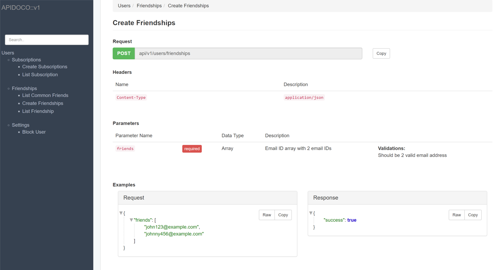
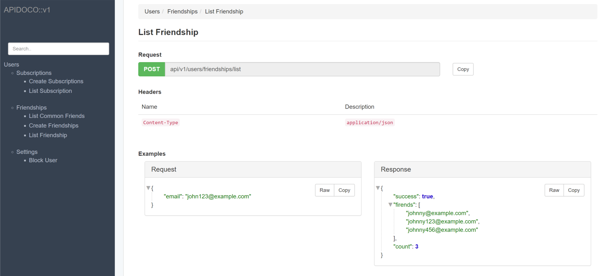
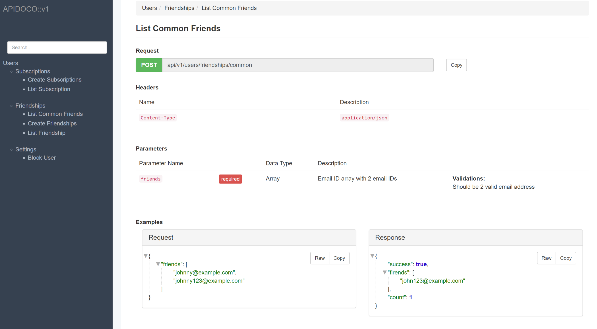
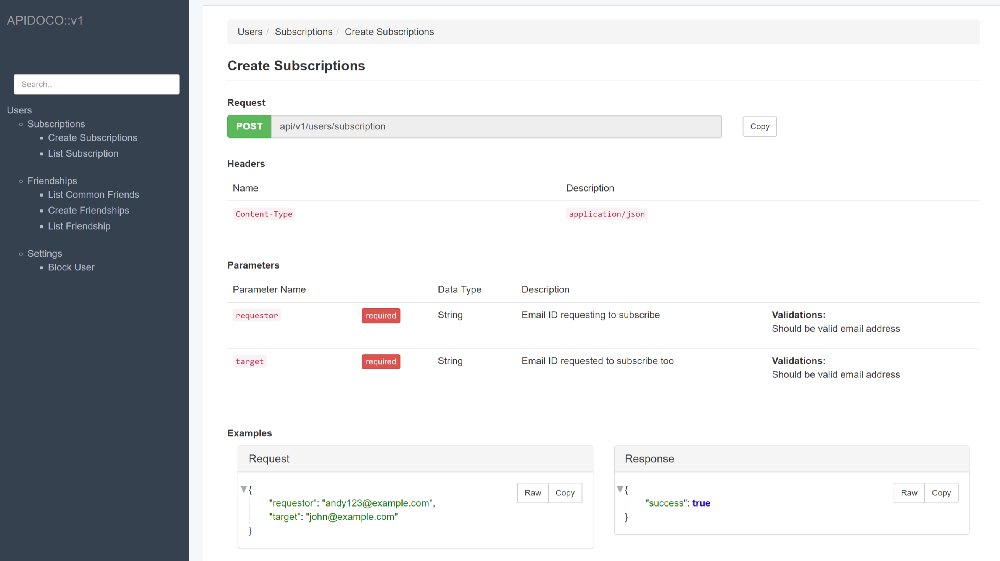
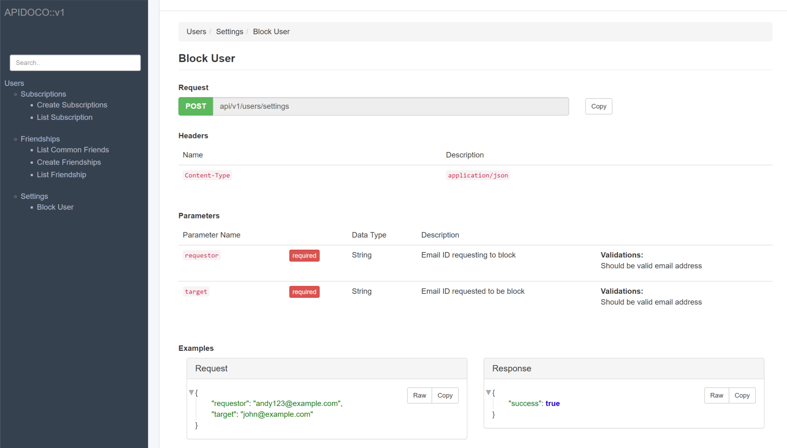
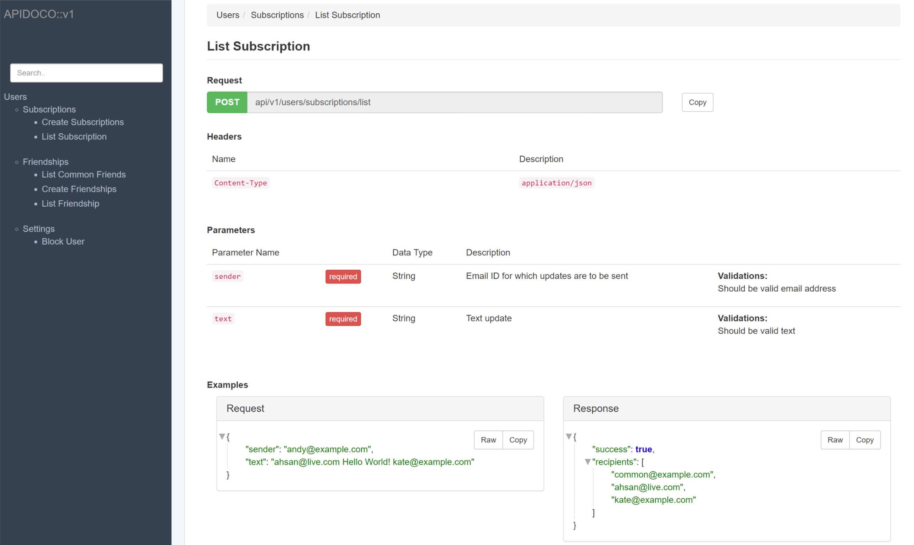

# README

* `Ruby` version used `2.5.1`

* `Rails` version used `5.2.0`

* System dependencies
  - `docker`
  - `docker-compose`


* Database creation

   - `docker-compose run app rails db:create`


* Database initialization

  -  `docker-compose run app rails db:migrate`


* How to run the test suite

  -  `docker-compose run app rails test`


* Deployment instructions

 - `docker-compose up`


To run the app execute command in following order

```
docker-compose run app rails db:create
docker-compose run app rails db:migrate
docker-compose up
```


* Documentation

  - Run the app and visit http://localhost:3000/docs

  *User story 1: Create Friendship*
  
  *User story 2: List Friends*
  
  *User story 3: Common Friends*
  
  *User story 4: Create Subscription*
  
  *User story 5: Block User*
  
  *User story 6: Subscription List*
  

